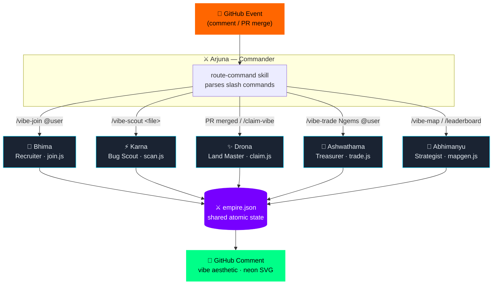

<div align="center">

# ⚔️ GitEmpire

### *Five Mahabharata warriors. One codebase. Infinite dharma.*

PRs become land. Bugs become bounties. Every commit echoes through the ages.

<br/>

[](https://github.com/open-gitagent/gitagent)
[](https://github.com/open-gitagent/gitclaw)
[](https://github.com/open-gitagent/clawless)
[](#validation)
[](LICENSE)
[](https://github.com/open-gitagent/gitagent)

<br/>

> *"The battlefield is the codebase. The war is the PR. The dharma is the diff."*

</div>

---

## 🎬 Demo

<!-- ═══════════════════════════════════════════════════════════════════════
     DEMO VIDEO
     Replace this block with your screen recording once captured.

     Recommended: record `npm run demo` in your terminal (shows all 8 steps
     + the rainbow ANSI scanner + the neon SVG preview opening in browser).

     Embed options:
       • GitHub-hosted MP4:  <video src="assets/demo.mp4" controls width="100%"/>
       • YouTube:            [](https://youtu.be/YOUR_ID)
       • GIF (< 10 MB):      
     ════════════════════════════════════════════════════════════════════════ -->

<div align="center">

> 📹 **Demo video coming soon** — record with `npm run demo` and drop it here.
>
> *(replace this block with `<video src="assets/demo.mp4" controls width="100%"/>` or a YouTube embed)*

</div>

---

## 🗺️ Architecture

<!-- ═══════════════════════════════════════════════════════════════════════
     ARCHITECTURE DIAGRAM
     Replace this block with your diagram once created.

     Recommended tools:
       • Excalidraw (https://excalidraw.com) — export as SVG, commit to assets/
       • draw.io / diagrams.net
       • Mermaid (renders natively in GitHub):

     ```mermaid
     graph TD
         GH[GitHub Event] --> A[Arjuna · Commander]
         A -->|/vibe-join| B[Bhima · Recruiter]
         A -->|/vibe-scout| K[Karna · Bug Scout]
         A -->|PR merged| D[Drona · Land Master]
         A -->|/vibe-trade| AS[Ashwathama · Treasurer]
         A -->|/vibe-map| AB[Abhimanyu · Strategist]
         B --> E[(empire.json)]
         K --> E
         D --> E
         AS --> E
         AB --> E
         E --> GH2[GitHub Comment]
     ```

     ════════════════════════════════════════════════════════════════════════ -->



<br/>

**Data flow:** GitHub event → Arjuna routes → warrior script runs → `empire.json` updated atomically → GitHub comment posted.

**One rule above all:** `empire.json` is read once, modified in memory, written once. No partial writes. No race conditions.

---

## 🏹 The Warriors

<table>
<thead>
<tr>
<th>Warrior</th>
<th>Archetype</th>
<th>Skill</th>
<th>Trigger</th>
<th>Soul</th>
</tr>
</thead>
<tbody>
<tr>
<td><strong>Arjuna</strong></td>
<td>Commander</td>
<td><code>route-command</code></td>
<td>All <code>/vibe*</code> events</td>
<td><em>"I do not fight every battle. I route the right warrior to the right war."</em></td>
</tr>
<tr>
<td><strong>Bhima</strong> 🌊</td>
<td>Recruiter</td>
<td><code>vibe-join</code></td>
<td><code>/vibe-join @user</code></td>
<td><em>"I am the largest warrior and the softest welcome."</em></td>
</tr>
<tr>
<td><strong>Karna</strong> ⚡</td>
<td>Bug Scout</td>
<td><code>bug-radar</code></td>
<td><code>/vibe-scout &lt;file&gt;</code></td>
<td><em>"Every bug is a trap in the chakravyuha of code."</em></td>
</tr>
<tr>
<td><strong>Drona</strong> ✨</td>
<td>Land Master</td>
<td><code>land-survey</code></td>
<td>PR merged · <code>/claim-vibe #N</code></td>
<td><em>"Land is not given — it is earned through lines that breathe."</em></td>
</tr>
<tr>
<td><strong>Ashwathama</strong> 🌙</td>
<td>Treasurer</td>
<td><code>gem-vault</code></td>
<td><code>/vibe-trade Ngems @user</code></td>
<td><em>"The gems remember every commit. The war chest does not forget."</em></td>
</tr>
<tr>
<td><strong>Abhimanyu</strong> 🌟</td>
<td>Strategist</td>
<td><code>battle-svg</code></td>
<td><code>/vibe-map</code> · <code>/leaderboard</code></td>
<td><em>"I entered the formation. I drew the map. I lit the neon grid."</em></td>
</tr>
</tbody>
</table>

---

## 🚀 Quickstart

### Prerequisites

- Node.js ≥ 18
- A Groq API key — [get one free](https://console.groq.com)
- (For live mode) A GitHub repo with Actions enabled

### Install

```bash
git clone https://github.com/charan-s108/GitEmpire
cd GitEmpire
npm install
cp .env.example .env        # then fill in GROQ_API_KEY
```

### Validate the spec

```bash
npm run validate
```

```
✓ agent.yaml — valid        (arjuna)
✓ agent.yaml — valid        (bhima)
✓ agent.yaml — valid        (karna)
✓ agent.yaml — valid        (drona)
✓ agent.yaml — valid        (ashwathama)
✓ agent.yaml — valid        (abhimanyu)
6/6 ✓ Validation passed (0 warnings)
```

---

## 🧪 Local Verification

Run the full warrior chain on your machine before touching GitHub. No API key needed.

```bash
npm run demo
```

This single command runs **8 verification steps** in sequence:

| Step | What it tests | Pass condition |
|------|--------------|----------------|
| 1 | `gitagent validate` on all 6 agents | 6/6 green, 0 warnings |
| 2 | Bhima registers 3 warriors + rejects duplicate | Duplicate skipped, not double-written |
| 3 | Drona claims 3 PRs with different complexity factors | Formula correct, duplicate PR blocked |
| 4 | Karna scans a file — rainbow ANSI to terminal | Findings reported, gems awarded |
| 5 | Ashwathama executes transfer + rejects overdraft + rejects self-transfer | Balances correct, both rejections clean |
| 6 | Abhimanyu generates leaderboard + SVG map | No errors, `battle_svg` written to empire.json |
| 7 | SVG decoded + written to `empire-preview.html` | File openable in browser |
| 8 | Final state table printed | Ranked correctly by gems |

**After `npm run demo` completes:**

```bash
# Preview the neon SVG empire map in your browser:
open empire-preview.html          # macOS
xdg-open empire-preview.html      # Linux
start empire-preview.html         # Windows
```

You should see a dark `#0d1117` canvas with glowing hex cells, player names, gem counts, and the neon legend — exactly what gets embedded in GitHub comments.

### Manual script testing

If you want to test individual warriors in isolation:

```bash
# Bhima — register a player
node agents/bhima/skills/vibe-join/scripts/join.js "@yourname"

# Karna — scan any file for bugs (rainbow ANSI output)
node agents/karna/skills/bug-radar/scripts/scan.js <filepath> <your-username>

# Drona — claim a PR (PR#, author, lines+, lines-, has_tests)
node agents/drona/skills/land-survey/scripts/claim.js 42 yourname 180 30 true

# Ashwathama — transfer gems
node agents/ashwathama/skills/gem-vault/scripts/trade.js sender 50 @receiver

# Abhimanyu — generate map or leaderboard
node agents/abhimanyu/skills/battle-svg/scripts/mapgen.js map
node agents/abhimanyu/skills/battle-svg/scripts/mapgen.js leaderboard
```

All scripts print the full GitHub comment they *would* post to stdout when `GITHUB_TOKEN` is not set — so you can review every output before going live.

### Inspect empire state

```bash
cat empire.json | python3 -m json.tool   # pretty-print
# or
node -e "const e=require('./empire.json'); console.table(Object.entries(e.players).map(([n,p])=>({name:n,gems:p.vibe_gems,acres:p.acres})))"
```

### Reset between runs

```bash
npm run demo -- --reset     # wipe empire.json then run full demo
```

---

## ⚙️ Live GitHub Setup

### 1. Create the repository

Push this repo to GitHub, then in **Settings → Topics** add:
```
gitagent-hackathon-2026
```

### 2. Add secrets

| Secret | Where to get it |
|--------|----------------|
| `GROQ_API_KEY` | [console.groq.com](https://console.groq.com) → API Keys |
| `GITHUB_TOKEN` | Auto-injected by Actions — nothing to add |

**Settings → Secrets and variables → Actions → New repository secret**

### 3. Fire the first command

Open any Issue and post:
```
/vibe-join @yourname
```

The `GitEmpire Warriors` workflow triggers within seconds. Bhima posts a reply:

```
## ⚔️ BHIMA | WARRIOR REGISTERED

  ( )
 (   )
(     )
 \   /
  \_/

Welcome: @yourname has entered the empire 🌊
Starter gems: 100 vibe-gems deposited to war chest
Empire Status: 1 warriors strong · top warrior: @yourname (100 gems, 0 acres)

---
🎵 flow time · GitEmpire v1.0
```

### 4. The full command set

| Post this comment | What happens |
|-------------------|-------------|
| `/vibe-join @user` | Bhima registers the warrior, awards 100 starter gems |
| `/vibe-scout src/auth.js` | Karna scans the file, posts findings table, awards bounty gems |
| `/claim-vibe #42` | Drona calculates gems + acres for PR #42, updates empire |
| `/vibe-trade 50gems @bob` | Ashwathama transfers 50 gems from you to @bob |
| `/vibe-map` | Abhimanyu generates the neon SVG map, embeds it in a comment |
| `/leaderboard` | Abhimanyu posts the top-5 rankings table |

PR merged with tests? **Drona triggers automatically** — no command needed.

---

## 💎 The Economy

### Vibe-Gem Formula

```
gems = max(10,  lines_changed  ×  (has_tests ? 3 : 1)  ×  complexity_factor)
```

| `complexity_factor` | Condition |
|---------------------|-----------|
| `2.0` | Net lines negative — dead code removed or major refactor |
| `1.5` | Function/class count reduced in diff |
| `1.0` | Neutral change (default) |
| `0.5` | >200 lines added with no test files |

**Floor:** 10 gems minimum per merged PR — shipping always pays.

### Bug Bounty Scale (Karna)

| Severity | Gems | Detected patterns |
|----------|------|------------------|
| 🔴 CRITICAL | 200 | `eval()`, command injection, unhandled promise rejections |
| 🟠 HIGH | 150 | `JSON.parse` without try/catch, off-by-one with `.length`, hardcoded secrets |
| 🟡 MEDIUM | 100 | `var` declarations, possible credential leaks via `console.log` |
| 🔵 LOW | 50 | TODO/FIXME/HACK comments, `debugger` statements |
| ⚪ INFO | 10 | Hardcoded IP addresses |

### Glow-Acres Formula

```
acres = floor(lines_changed / 50)   // 1 acre per 50 lines touched
```

---

## 🎨 Neon SVG Spec

Abhimanyu's empire map uses **only** these eight colors:

```javascript
const COLORS = {
  bg:      '#0d1117',   // GitHub dark canvas
  grid:    '#1a2332',   // subtle grid lines
  players: ['#00ff88',  // matrix green   — rank 1
            '#ff0066',  // hot pink        — rank 2
            '#00d4ff',  // cyber cyan      — rank 3
            '#ffaa00',  // amber           — rank 4+
            ...],
  neutral: '#7700ff',   // deep purple    — unclaimed territory
  war:     '#ff6600',   // fire orange    — active war fronts
  text:    '#e6edf3',   // GitHub text
  accent:  '#00d4ff',   // highlight
};
```

Every territory polygon carries:
```css
filter: drop-shadow(0 0 6px <color>)   /* neon glow — no exceptions */
```

Active war fronts animate:
```css
@keyframes warPulse {
  0%   { stroke-dashoffset: 0;   opacity: 1;   }
  50%  {                         opacity: 0.6; }
  100% { stroke-dashoffset: -24; opacity: 1;   }
}
.war-border { animation: warPulse 1.4s linear infinite; }
```

---

## 📐 Spec Compliance

GitEmpire is built on **GitAgent v0.1.0** — the git-native agent specification.

| Requirement | Status |
|-------------|--------|
| `agent.yaml` with `spec_version`, `name`, `version`, `description` | ✅ All 6 agents |
| `SOUL.md` identity file per agent | ✅ All 6 agents |
| `SKILL.md` with valid YAML frontmatter per skill | ✅ All 6 skills |
| `agents:` as object keyed by agent name (not array) | ✅ Confirmed by AJV |
| `skills:` as array of kebab-case strings | ✅ Confirmed by AJV |
| `gitagent-hackathon-2026` tag in every `agent.yaml` | ✅ All 6 agents |
| `gitagent validate` passes with 0 warnings | ✅ `npm run validate` |
| ClawLess compatibility (pure Node.js, no native addons) | ✅ `npm run clawless` |
| `RULES.md` + `DUTIES.md` per agent (SOD policy) | ✅ Root + all 5 warriors |
| Single atomic `empire.json` write pattern | ✅ All scripts |

---

## 🏗️ Repository Structure

```
GitEmpire/
├── agent.yaml                    ← Arjuna (root coordinator)
├── SOUL.md                       ← Arjuna identity
├── RULES.md                      ← System-wide gem/acres formulas
├── DUTIES.md                     ← Root SOD policy + conflict matrix
├── AGENTS.md                     ← Fallback reference for non-gitagent tools
├── empire.json                   ← Shared atomic state
├── package.json                  ← scripts: validate, dev, demo, clawless
├── .env.example
│
├── skills/
│   └── route-command/SKILL.md    ← Command parsing + routing table
│
├── agents/
│   ├── bhima/                    ← Recruiter
│   │   ├── agent.yaml · SOUL.md · RULES.md · DUTIES.md
│   │   └── skills/vibe-join/
│   │       ├── SKILL.md
│   │       └── scripts/join.js   ← register player, award 100 gems
│   │
│   ├── karna/                    ← Bug Scout
│   │   ├── agent.yaml · SOUL.md · RULES.md · DUTIES.md
│   │   └── skills/bug-radar/
│   │       ├── SKILL.md
│   │       └── scripts/scan.js   ← 15 bug patterns, rainbow ANSI, bounties
│   │
│   ├── drona/                    ← Land Master
│   │   ├── agent.yaml · SOUL.md · RULES.md · DUTIES.md
│   │   └── skills/land-survey/
│   │       ├── SKILL.md
│   │       └── scripts/claim.js  ← gem formula, acres, duplicate guard
│   │
│   ├── ashwathama/               ← Treasurer
│   │   ├── agent.yaml · SOUL.md · RULES.md · DUTIES.md
│   │   └── skills/gem-vault/
│   │       ├── SKILL.md
│   │       └── scripts/trade.js  ← transfer, overdraft guard, war chest
│   │
│   └── abhimanyu/                ← Strategist
│       ├── agent.yaml · SOUL.md · RULES.md · DUTIES.md
│       └── skills/battle-svg/
│           ├── SKILL.md
│           └── scripts/mapgen.js ← neon hex SVG, glow filters, leaderboard
│
├── scripts/
│   └── demo.js                   ← local verification: 8-step full chain
│
└── .github/
    └── workflows/
        └── gitempire.yml         ← per-step command routing + auto-claim
```

---

## 🔧 npm Scripts

| Command | What it does |
|---------|-------------|
| `npm run validate` | `gitagent validate` on all 6 agents |
| `npm run demo` | Full 8-step local verification chain |
| `npm run demo -- --reset` | Reset empire.json then run full demo |
| `npm run dev` | `gitclaw run --coordinator arjuna --recursive` |
| `npm run clawless` | Launch in ClawLess browser runtime |

---

## 🛠️ Stack

| Layer | Choice | Why |
|-------|--------|-----|
| Agent spec | [GitAgent v0.1.0](https://github.com/open-gitagent/gitagent) | The hackathon target spec |
| Runtime | [gitclaw v1.3.3](https://github.com/open-gitagent/gitclaw) | Git-native agent executor |
| Browser runtime | [clawless](https://github.com/open-gitagent/clawless) | WebContainer WASM — zero server |
| CI/CD | GitHub Actions | Free, event-driven, native to git |
| LLM | `groq/llama-3.3-70b-versatile` | Fast inference, generous free tier |
| Language | Node.js 20 | Clawless-compatible, no native addons |
| State | `empire.json` | One file, atomic writes, git-tracked |
| No Python · No databases · No paid infra beyond Groq |

---

<div align="center">

## 🎵 *lofi hiphop · ancient dharma · vibe coding*

**GitEmpire v1.0** · Built for the **GitAgent Hackathon 2026** · by [@charan-s108](https://github.com/charan-s108)

*"The battlefield is the codebase. The war is the PR. The dharma is the diff."*

[](https://github.com/topics/gitagent-hackathon-2026)

</div>
